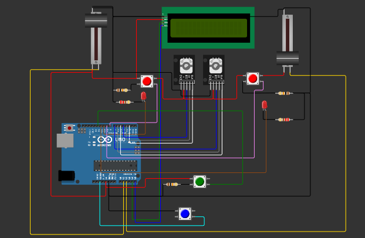
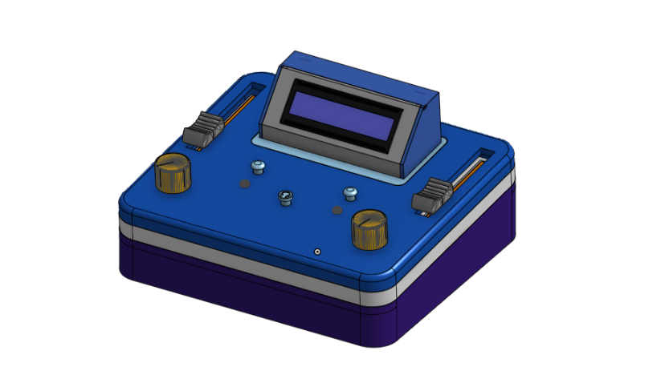

This is a fork of deej. Original author's version is [here](https://github.com/omriharel/deej).

# deej

deej is an **open-source hardware volume mixer** for Windows and Linux PCs. It lets you use real-life sliders (like a DJ!) to **seamlessly control the volumes of different apps** (such as your music player, the game you're playing and your voice chat session) without having to stop what you're doing.

**Join the [deej Discord server](https://discord.gg/nf88NJu) if you need help or have any questions!**

[](https://discord.gg/nf88NJu)

deej consists of a [lightweight desktop client](#features) written in Go, and an Arduino-based hardware setup that's simple and cheap to build. [**Check out some versions built by members of our community!**](./community.md)

**[Download the latest release](https://github.com/omriharel/deej/releases/latest) | [Video demonstration](https://youtu.be/VoByJ4USMr8) | [Build video by Tech Always](https://youtu.be/x2yXbFiiAeI)**


> _**Psst!** [No 3D printer? No problem!](./assets/build-shoebox.jpg)_ You can build deej on some cardboard, a shoebox or even a breadboard :)

# This fork
I started creating this fork becouse i didn't like the limitation of the fact that i can only have as much channels as much physical faders. This fork allows you to independently controll unlimited amount of apps with only 2 faders.


## Table of contents

- [Features](#features)
- [How it works](#how-it-works)
  - [Hardware](#hardware)
    - [Schematic](#schematic)
  - [Software](#software)
- [Slider mapping (configuration)](#slider-mapping-configuration)
- [Build your own!](#build-your-own)
  - [Bill of Materials](#bill-of-materials)
  - [Thingiverse collection](#thingiverse-collection)
  - [Build procedure](#build-procedure)
- [How to run](#how-to-run)
  - [Requirements](#requirements)
  - [Download and installation](#download-and-installation)
  - [Building from source](#building-from-source)
- [Community](#community)

## Features

deej is written in Go and [distributed](https://github.com/omriharel/deej/releases/latest) as a portable (no installer needed) executable.

- Bind apps to different sliders
  - Bind multiple apps per slider (i.e. one slider for all your games)
  - Bind the master channel
  - Bind "system sounds" (on Windows)
  - Bind specific audio devices by name (on Windows)
  - Bind currently active app (on Windows)
  - Bind all other unassigned apps
- Control your microphone's input level
- Lightweight desktop client, consuming around 10MB of memory
- Runs from your system tray
- Helpful notifications to let you know if something isn't working

## How it works

### Hardware

I don't realy know how to explain how it works becouse it is overly complicated but feel free to message me for an explenation. I'll be hapy to help.

#### Schematic
You can try to figure out connections from phgoto belov or go to [wokwi](https://wokwi.com/projects/384315318959019009) to trace connections one by one.



### Software

- The code running on the Arduino board is a [C program](./arduino/deej-2-faders/deej-2-faders.ino) constantly writing current slider values over its serial interface
- The PC runs a lightweight [Go client](./pkg/deej/cmd/main.go) in the background. This client reads the serial stream and adjusts app volumes according to the given configuration file

## Slider mapping (configuration)

deej uses a simple YAML-formatted configuration file named [`config.yaml`](./config.yaml), placed alongside the deej executable.

The config file determines which applications (and devices) are mapped to which sliders, and which parameters to use for the connection to the Arduino board, as well as other user preferences.

**This file auto-reloads when its contents are changed, so you can change application mappings on-the-fly without restarting deej.**

It looks like this:

```yaml
slider_mapping:
  0: master
  1: chrome.exe
  2: spotify.exe
  3:
    - pathofexile_x64.exe
    - rocketleague.exe
  4: discord.exe

# set this to true if you want the controls inverted (i.e. top is 0%, bottom is 100%)
invert_sliders: false

# settings for connecting to the arduino board
com_port: COM4
baud_rate: 9600

# adjust the amount of signal noise reduction depending on your hardware quality
# supported values are "low" (excellent hardware), "default" (regular hardware) or "high" (bad, noisy hardware)
noise_reduction: default
```

- `master` is a special option to control the master volume of the system _(uses the default playback device)_
- `mic` is a special option to control your microphone's input level _(uses the default recording device)_
- `deej.unmapped` is a special option to control all apps that aren't bound to any slider ("everything else")
- On Windows, `deej.current` is a special option to control whichever app is currently in focus
- On Windows, you can specify a device's full name, i.e. `Speakers (Realtek High Definition Audio)`, to bind that device's level to a slider. This doesn't conflict with the default `master` and `mic` options, and works for both input and output devices.
  - Be sure to use the full device name, as seen in the menu that comes up when left-clicking the speaker icon in the tray menu
- `system` is a special option on Windows to control the "System sounds" volume in the Windows mixer
- All names are case-**in**sensitive, meaning both `chrome.exe` and `CHROME.exe` will work
- You can create groups of process names (using a list) to either:
    - control more than one app with a single slider
    - choose whichever process in the group that's currently running (i.e. to have one slider control any game you're playing)

## Build your own!

Building deej is very simple. You only need a few relatively cheap parts - it's an excellent starter project (and my first Arduino project, personally). Remember that if you need any help or have a question that's not answered here, you can always [join the deej Discord server](https://discord.gg/nf88NJu).

Build deej for yourself, or as an awesome gift for your gaming buddies!

### Bill of Materials

- An Arduino Nano, Pro Micro or Uno board
  - I am using arduino Uno becouse it is the one I had on me when I started this project but I recommend using a Nano or a Pro Micro for their smaller form-factor, friendlier USB connectors and more analog pins. In the feature i am planning on moving to nano.
  - You can also use any other development board that has a Serial over USB interface
- 2 slide potentiometers
- 16x2 lcd display with I2C interface
- 2 rotary encoders
- 2 buttons
- 2 10 kOhm resistors for buttons (you can use Digital Input Pull-Up Resistor instead of resistors but you would have to change wiring of buttons a bit) [More info about Input Pull-Up Resistor](https://docs.arduino.cc/tutorials/generic/digital-input-pullup/)
Optional:
- 2 LED + 2 resistors with at least 220 Ohms (if you use ones with higher ressistance your led will be dimmer)
  - **Important:** make sure to get **linear** sliders, not logarithmic ones! Check the product description
  - You can also use circular knobs if you like
- Some wires
- Any kind of box to hold everything together. **You don't need a 3D printer for this project!** It works fantastically with just a piece of cardboard or a shoebox. That being said, if you do have one, read on...

### Project

This is a [link](https://cad.onshape.com/documents/e962826a6bddd0371af3b525/w/1bc1de2374e5e503c60dc035/e/108ce40760af3f3220ca9e50?configuration=default&renderMode=0&uiState=65b183c564f0d92ca57b1bef) to 3D model made by by me. It is shitty and honestly I wouldn't recoment using it but feel free to copy some of my ideas if you want.




### Build procedure

- Connect everything according to the [schematic](#schematic)
- Test with a multimeter to be sure your sliders are hooked up correctly
- Flash the Arduino chip with the sketch in [`arduino\deej-2-faders`](./arduino/deej-2-faders/deej-2-faders.ino)
  - _Important:_ If you have more or less than 2 sliders, you must edit the sketch to match what you have
- After flashing, check the serial monitor. You should see a constant stream of values separated by a pipe (`|`) character, e.g. `0|240|1023|0|483`
  - When you move a slider, its corresponding value should move between 0 and 1023
- Congratulations, you're now ready to run the deej executable!

## How to run

### Requirements

#### Windows

- Windows. That's it

#### Linux

- [go to to original author to check the requirments for linux](https://github.com/omriharel/deej?tab=readme-ov-file#requirements)

### Download and installation

- [go to to original author to check the requirments for linux](https://github.com/omriharel/deej?tab=readme-ov-file#requirements)


### Building from source

If you'd rather not download a compiled executable, or want to extend deej or modify it to your needs, feel free to clone the repository and build it yourself. That's what author said. I **didn't** modify Go part of deej for my fork so I'd recomend you copy from the source. All you need is a Go 1.14 (or above) environment on your machine. If you go this route, make sure to check out the [developer scripts](https://github.com/omriharel/deej/tree/master/pkg/deej/scripts).

Like other Go packages, you can also use the `go get` tool: `go get -u github.com/omriharel/deej`. Please note that the package code now resides in the `pkg/deej` directory, and needs to be imported from there if used inside another project.

If you need any help with this, please [join deej Discord server](https://discord.gg/nf88NJu).

## Community

[](https://discord.gg/nf88NJu)

deej is a relatively new project, but a vibrant and awesome community is rapidly growing around it. Come hang out with us in the [deej Discord server](https://discord.gg/nf88NJu), or check out a whole bunch of cool and creative builds made by our members in the [community showcase](https://github.com/omriharel/deej/blob/master/community.md).

The server is also a great place to ask questions, suggest features or report bugs (but of course, feel free to use GitHub if you prefer).

### Donations

I don't take donations but if you want to support authior fo this awesome project go [here](https://github.com/omriharel/deej/tree/master?tab=readme-ov-file#community) (it's not any sketchy link, just link to authirs page).
